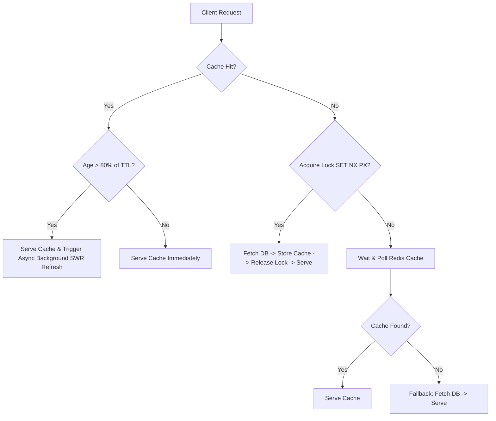

# Restaurant OS — Redis Caching Architecture

This document describes the design and implementation of the high-performance caching layer in the Restaurant OS backend.

---

## 1. Caching Flow Diagram



---

## 2. Key Naming & Versioning

All cache keys are strictly versioned to prevent race conditions during updates and to support horizontal scalability.

### Naming Convention
* **Standard versioned key**: `{entity_type}:{entity_id}:v{version_number}`
* **Version lookup key**: `version:{entity_type}:{entity_id}`

Bumping a version increments the `version:...` integer. This automatically renders old cache keys obsolete (they will naturalmente expire when their TTL terminates).

---

## 3. Distributed Lock (Stampede Protection)

Under high concurrent traffic, if the cache expires, a "cache stampede" can overload PostgreSQL. We implement stampede protection using a Redis lock:
1. When a cache miss occurs, the backend attempts to write `lock:{key}` using `SET NX PX 4000`.
2. The winner request queries PostgreSQL, writes the cache, and deletes the lock.
3. Other concurrent requests fail to acquire the lock and enter a retry loop, polling Redis every 150ms.
4. If the lock times out, the backend gracefully falls back to PostgreSQL to prevent request stalling.

---

## 4. Background Refresh (Stale-While-Revalidate)

To keep response times under 5ms, we use a Stale-While-Revalidate pattern:
* Values are stored wrapped in a metadata envelope containing `cachedAt` timestamps.
* If a cache hit's age exceeds 80% of its TTL, the backend returns the cached value instantly and fires an asynchronous background task to revalidate and refresh the cache.

---

## 5. Cache Warming on Mutation & Startup

* **Mutation Warming**: When a menu item or profile is updated, we increment the version key and immediately run background DB queries to write the new data to the versioned cache keys.
* **Startup preloading**: When the node server boots, it queries the top 5 active restaurants and preloads their public menus to prevent database cold starts on new deployments.

---

## 6. Compression & Integrity

* **Gzip Compression**: All cached items larger than 1KB (such as consolidated public menus) are compressed using Node's native `zlib.gzip` before being set in Redis, optimizing memory usage.
* **Cache Integrity**: We never cache `null`, `undefined`, database error objects, or 404 responses.

---

## 7. Metrics & Observability

Detailed performance indicators are tracked in-memory and can be read by administrators at:
`GET /metrics/cache`

```json
{
  "hitCount": 10842,
  "missCount": 242,
  "hitRatio": "97.81%",
  "errorCount": 0,
  "dbFallbackCount": 0,
  "stampedeLockCount": 12,
  "cacheWarmCount": 24,
  "backgroundRefreshCount": 118,
  "invalidationCount": 15,
  "avgRedisResponseTimeMs": "1.82ms",
  "avgDbResponseTimeMs": "48.24ms"
}
```
