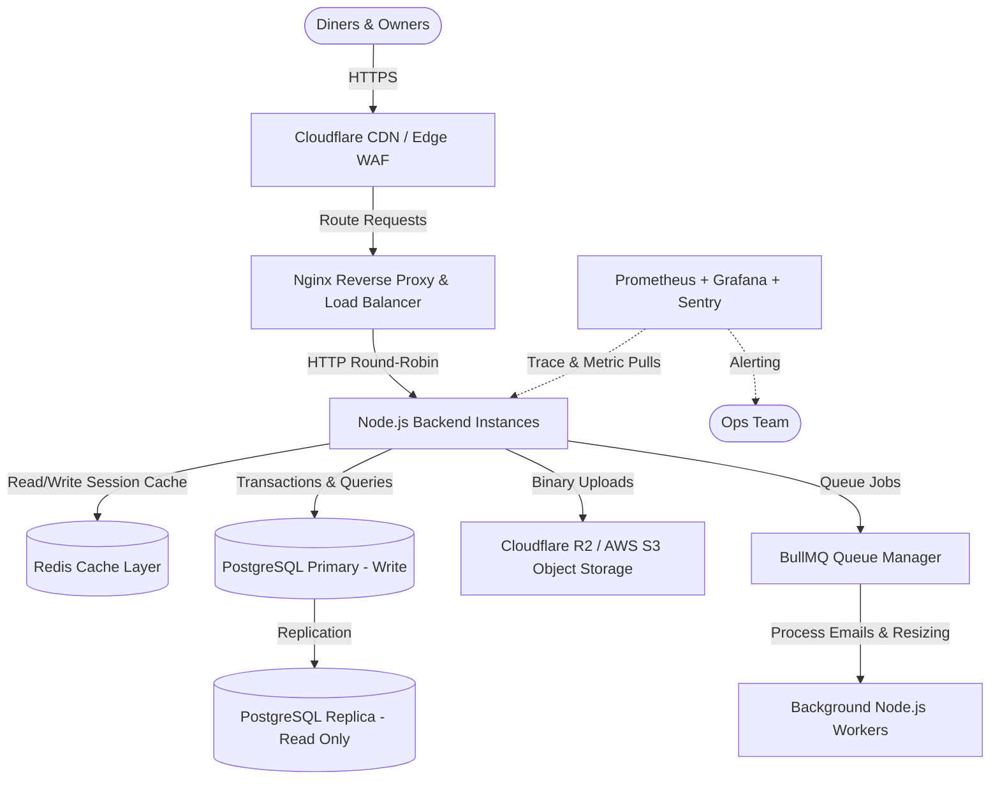
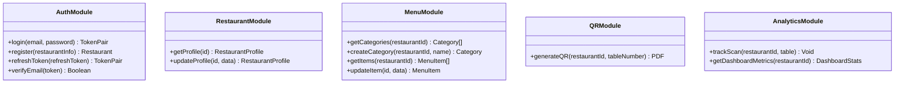
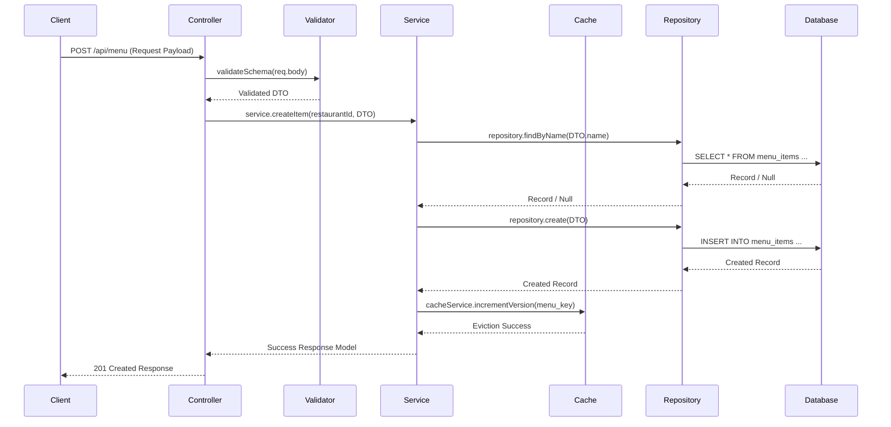
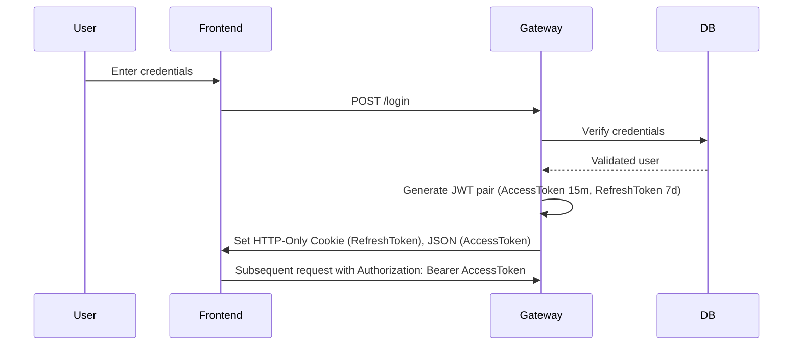
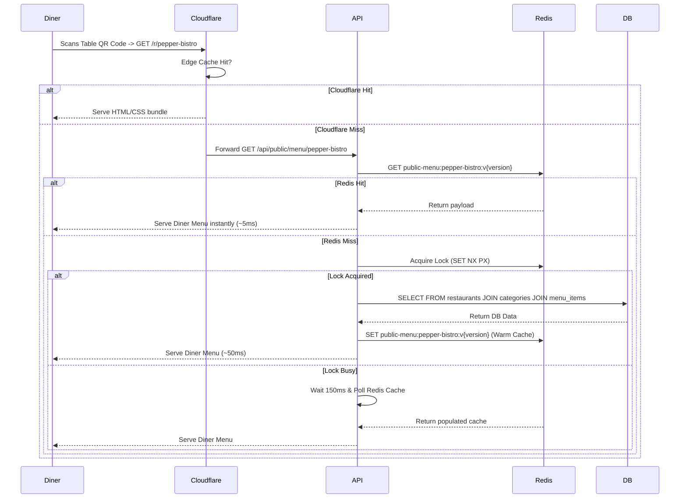
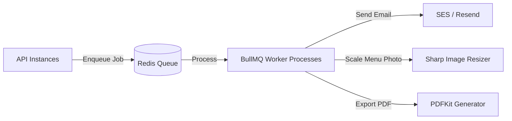
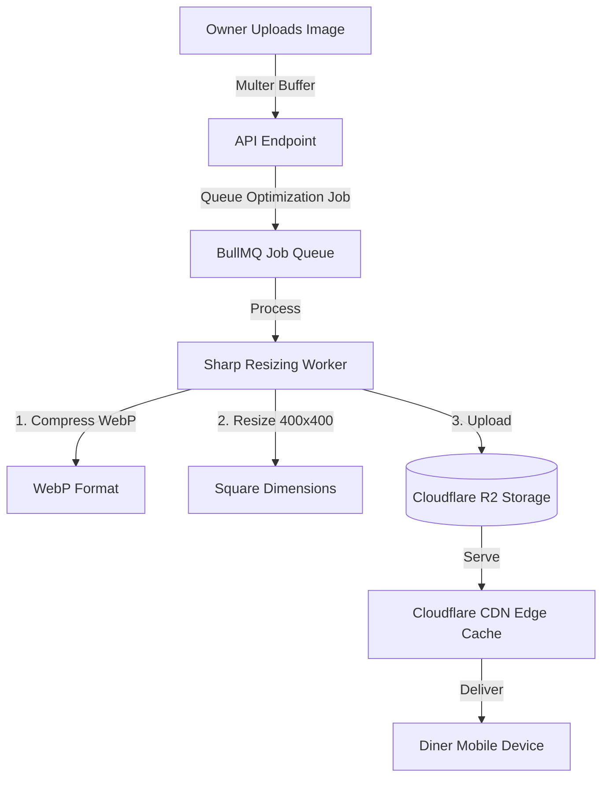
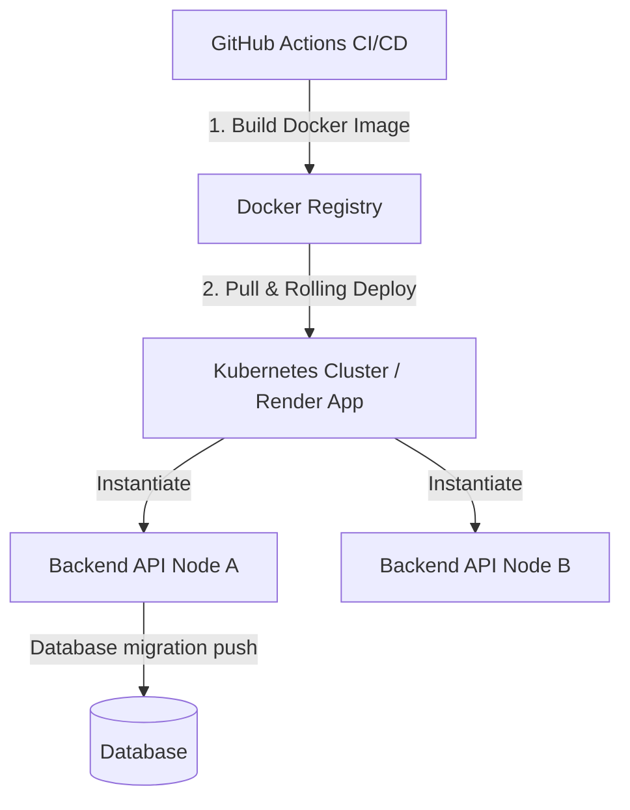
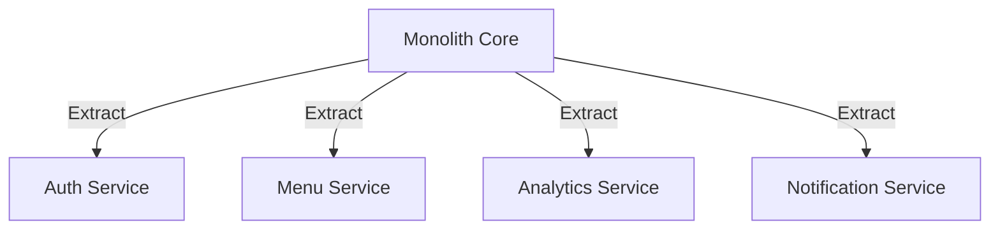

# Restaurant OS — Enterprise System Design & Architecture Specification

This document serves as the single source of truth for the system design, database architecture, caching strategies, scaling plans, and future microservice migration pathways for **Restaurant OS**.

---

## 1. High-Level Architecture (HLD)

The system follows a cloud-agnostic, horizontally scalable architecture.



### HLD Component Details:
1. **Cloudflare WAF & CDN**: Handles SSL termination, mitigates DDoS attacks at Layer 3/4/7, and caches public static assets (React bundle assets, restaurant logo images) at edge nodes.
2. **Nginx Reverse Proxy**: Offloads gzip/brotli compression, rate limits requests per IP, and load balances incoming requests across multiple backend API servers.
3. **Backend API Instances**: Stateless Node.js / Express containers running on Kubernetes or Render. Horizontally scalable behind the load balancer.
4. **Redis Cache Layer**: Production-hardened memory cache supporting versioned keys, stampede locks, and background refreshes (SWR).
5. **PostgreSQL Database**: Persistent transactional database. Set up with connection pooling (e.g., PgBouncer) and a primary-replica cluster to isolate heavy read-only loads (like analytics) from writes.
6. **Object Storage (R2/S3)**: Houses restaurant assets (menu photos, cover banners). Served directly via Cloudflare CDN to bypass backend bandwidth limits.
7. **BullMQ Worker Queue**: Manages CPU-intensive tasks asynchronously (generating PDF QR codes, resizing uploads, sending confirmation emails).

---

## 2. Low-Level Design (LLD)

### Module Map & Interface Specs



### Module Responsibilities:
1. **AuthModule**: Manages restaurant registration, authentication, JWT token rotations, and email verification states.
2. **RestaurantModule**: Handles basic profile fields, working hours, locations, and styling settings.
3. **MenuModule**: Handles category structure, display order, veg/non-veg tags, item availability, and prices.
4. **QRModule**: Maps restaurant tables to public menu slug paths and exports printable vector PDF codes.
5. **AnalyticsModule**: Aggregates visitor counts, category clicks, and item popularity metrics.

---

## 3. Scalable Folder Architecture

To ensure code maintainability as features grow, the directory structure is organized by modules and shared layers rather than simple controller/route splits:

```
ros/
├── frontend/                     # React App Source
│   ├── src/
│   │   ├── components/           # Reusable UI Elements (VegIndicator, Buttons)
│   │   ├── layouts/              # MainLayout, AuthLayout
│   │   ├── pages/                # Lazy loaded views (Dashboard, Menu, Landing)
│   │   ├── routes/               # Suspense-wrapped Route Configs
│   │   ├── services/             # Axios API instances
│   │   └── types/                # Strict Type mappings
└── backend/                      # Backend Core
    ├── prisma/
    │   ├── schema.prisma         # Single DB Schema Definition
    │   └── migrations/
    ├── src/
    │   ├── app.ts                # Express configuration (Middlewares, context)
    │   ├── server.ts             # Process startup script
    │   ├── config/               # Central Configs (env, database, CacheConfig)
    │   ├── utils/                # Caching, Context (AsyncLocalStorage), logging
    │   ├── middleware/           # authMiddleware, rate-limiters, errorMiddleware
    │   ├── modules/              # FEATURE MODULES
    │   │   ├── auth/
    │   │   │   ├── auth.controller.ts
    │   │   │   ├── auth.service.ts
    │   │   │   ├── auth.repository.ts
    │   │   │   ├── auth.routes.ts
    │   │   │   └── auth.validation.ts
    │   │   ├── menu/             # Categories & Items management
    │   │   └── restaurant/       # Profile management
    │   ├── workers/              # Asynchronous processors
    │   │   ├── image.worker.ts
    │   │   └── email.worker.ts
    │   └── types/                # Custom typescript declarations
    └── docs/                     # Architectural documents (REDIS_ARCHITECTURE)
```

---

## 4. Backend Layered Architecture

Each request flows through strict architectural boundaries to enforce separation of concerns:



* **Controller**: Handles HTTP request parsing, cookie parsing, status code responses. *No business logic.*
* **Validator**: Enforces compile-time type validation via Zod schemas before service execution.
* **Service**: Holds domain-specific business calculations, workflows, transactional checks, caching policies, and notifications.
* **Repository**: Contains data storage interactions. Executes queries using the Prisma Client. *No business logic.*

---

## 5. Database Schema Design

The PostgreSQL database structure uses the schema below, optimized with indexes for query speeds and relational foreign key cascading:

```prisma
datasource db {
  provider = "postgresql"
  url      = env("DATABASE_URL")
}

model Restaurant {
  id             String           @id @default(cuid())
  restaurantName String           @map("restaurant_name")
  ownerName      String           @map("owner_name")
  description    String?
  slug           String           @unique
  email          String           @unique
  phone          String           @unique
  passwordHash   String           @map("password_hash")
  status         RestaurantStatus @default(PENDING)
  logoUrl        String?          @map("logo_url")
  coverImageUrl  String?          @map("cover_image_url")
  createdAt      DateTime         @default(now()) @map("created_at")
  updatedAt      DateTime         @updatedAt @map("updated_at")
  tokens         Token[]
  categories     Category[]
  menuItems      MenuItem[]

  @@map("restaurants")
}

model Token {
  id           String     @id @default(cuid())
  restaurantId String     @map("restaurant_id")
  restaurant   Restaurant @relation(fields: [restaurantId], references: [id], onDelete: Cascade)
  tokenHash    String     @unique @map("token_hash")
  type         TokenType
  expiresAt    DateTime   @map("expires_at")
  used         Boolean    @default(false)
  createdAt    DateTime   @default(now()) @map("created_at")

  @@index([restaurantId])
  @@map("tokens")
}

model Category {
  id             String      @id @default(cuid())
  restaurantId   String      @map("restaurant_id")
  restaurant     Restaurant  @relation(fields: [restaurantId], references: [id], onDelete: Cascade)
  name           String
  displayOrder   Int         @default(0) @map("display_order")
  createdAt      DateTime    @default(now()) @map("created_at")
  updatedAt      DateTime    @updatedAt @map("updated_at")
  menuItems      MenuItem[]

  @@unique([restaurantId, name])
  @@map("categories")
}

model MenuItem {
  id             String      @id @default(cuid())
  categoryId     String      @map("category_id")
  category       Category    @relation(fields: [categoryId], references: [id], onDelete: Cascade)
  restaurantId   String      @map("restaurant_id")
  restaurant     Restaurant  @relation(fields: [restaurantId], references: [id], onDelete: Cascade)
  name           String
  slug           String
  description    String?
  price          Decimal     @db.Decimal(10, 2)
  imageUrl       String?     @map("image_url")
  isVeg          Boolean     @default(true) @map("is_veg")
  isAvailable    Boolean     @default(true) @map("is_available")
  displayOrder   Int         @default(0) @map("display_order")
  createdAt      DateTime    @default(now()) @map("created_at")
  updatedAt      DateTime    @updatedAt @map("updated_at")

  @@unique([restaurantId, slug])
  @@unique([categoryId, name])
  @@map("menu_items")
}
```

### Optimizations & Audit Extensions
* **Indexes**: Added explicit query index on `Token(restaurantId)` to accelerate active sessions lookup. Composite unique keys serve as implicit query indexes (e.g. `[restaurantId, name]` in Category).
* **Multi-Tenancy**: Enforced via `restaurantId` on all business models. Access middleware filters queries using context restaurant attributes extracted from validated JWT claims.

---

## 6. Redis Caching Architecture

Caching is optimized for high-throughput edge serving with the following parameters:

* **Stale-While-Revalidate (SWR)**: Responses are stored inside a metadata envelope containing the timestamp. When read, if the record age exceeds 80% of its TTL, the stale cache is immediately served to the diner, and a background database revalidation request is executed.
* **Command Timeout Protection**: To prevent Redis performance drops from affecting service uptime, all commands are raced against a `300ms` promise timeout limit. If timed out, the backend falls back to querying PostgreSQL.
* **Stampede Lock (SET NX PX)**: If a cache miss occurs, the backend writes a lock `lock:{key}`. Only the first concurrent request queries PostgreSQL; secondary requests poll the cache every 150ms.
* **Key Versioning**: We store entity versions (e.g. `version:menu:{id}`) and append them to the cache key (e.g. `menu:{id}:v2`). Cache invalidation increments this version key instead of performing expensive wildcard deletes or pipeline invalidations.

---

## 7. API Architecture

The Restful API standard follows these best practices:
* **Enforced JSON Payload Format**:
  ```json
  {
    "success": true,
    "message": "Item updated successfully",
    "data": { ... }
  }
  ```
* **Pagination & Sorting Standard**: `GET /api/menu?page=1&limit=20&sortBy=price&sortOrder=asc`
* **Response Codes**:
  * `200 OK` / `201 Created`
  * `400 Bad Request` (Zod validation violations)
  * `401 Unauthorized` / `403 Forbidden`
  * `404 Not Found`
  * `429 Too Many Requests` (Rate limits exceeded)
  * `500 Internal Server Error`

---

## 8. Authentication & Token Lifecycle

Secure token rotation and authentication sessions are managed via JWT pairs:



* **Access Token**: Short-lived (15 minutes), stored in memory by the React app.
* **Refresh Token**: Long-lived (7 days), stored in an `httpOnly`, secure, `SameSite=Strict` cookie.
* **Token Rotation**: On `/refresh`, the backend verifies the signature, invalidates the old Refresh Token, and issues a new pair.

---

## 9. Diner Request Lifecycle (Public Menu Flow)



---

## 10. Background Processing Queue Architecture

CPU-bound tasks are managed by **BullMQ** asynchronously, offloading main event loop threads:



* **Job Serialization**: Jobs are queued with specific payloads containing resource IDs (e.g. `{ itemImageId: "item_id_1" }`).
* **Scale-Out**: BullMQ workers are hosted in independent processes and can be scaled separately from HTTP nodes.

---

## 11. Image Processing & Storage Architecture

Images are stored in S3-compatible object storage (e.g., Cloudflare R2) and optimized before serving:



* **Optimization Parameters**: Compressed to lossy WebP at 80% quality.
* **Storage Pathing**: Organized by restaurant namespaces to keep folders structured: `/uploads/menu/restaurants/{restaurant_id}/{item_slug}.webp`.

---

## 12. Security Architecture

Multiple defense-in-depth measures secure the SaaS infrastructure:
1. **JSON Web Tokens (JWT)**: Cryptographically signed via HS256, protecting state verification from tampering.
2. **Helmet Middleware**: Configures HTTP security headers (prevents iframe clickjacking, XSS sanitization overrides).
3. **CORS Restrictions**: Standardizes origin configurations, permitting only verified frontend environments.
4. **Express Rate-Limiter**: Limits login, signup, and reset requests to prevent brute-force attacks.
5. **SQL Injection Defense**: Prisma ORM uses parameterized queries for all operations, making SQL injection impossible.
6. **File Upload Verification**: Restricts Multer uploads to verified MIME types (`image/jpeg`, `image/png`, `image/webp`) and enforces a 2MB size limit.

---

## 13. System Observability Stack

The telemetry architecture uses the following tools:
* **Metrics**: Prometheus pulls HTTP request counts, DB connections, and CPU usage. Visualized via Grafana.
* **Error Reporting**: Sentry captures backend runtime errors and frontend exceptions, grouping duplicates automatically.
* **Uptime Logs**: Morgan writes structured JSON request traces. Health metrics are served via `/health`.

---

## 14. Deployment Architecture

The system is containerized via Docker and deployed using zero-downtime rolling updates:



* **Docker Multi-stage Builds**: Separates compilation environments from lightweight production images to minimize container size.
* **Graceful Shutdown**: The Node listener traps `SIGTERM`/`SIGINT` signals and allows in-flight HTTP requests to complete before releasing DB and cache connections.

---

## 15. Scaling Strategy Roadmap

As Restaurant OS grows, the infrastructure adapts at each scale tier:

### Stage 1: up to 100 Restaurants (Current)
* **Hosting**: Render starter containers.
* **Database**: Neon Serverless / Single PostgreSQL RDS.
* **Redis**: Render Redis or single Upstash instance.
* **Queue**: Simple local disk/worker loops.
* **Bottlenecks**: Bandwidth caps, cold start database scale delays.

### Stage 2: 100 to 1,000 Restaurants
* **Upgrade**: Upgrade backend to dedicated compute instances (e.g. AWS ECS / DigitalOcean Droplets).
* **Database**: Enable PG connection pooling (PgBouncer) to manage connection limits.
* **Object Storage**: Migrate local multer disk uploads to Cloudflare R2.
* **Queues**: Implement dedicated BullMQ queue running on a separate worker container.

### Stage 3: 1,000 to 10,000 Restaurants
* **Upgrade**: Transition to Kubernetes (EKS / GKE) for auto-scaling API containers.
* **Database**: Implement Primary-Replica replication. Redirect all read queries (diner menu loads) to Read Replicas, leaving the Primary database dedicated to writes.
* **Redis**: Deploy a multi-node Redis cluster with failover replication.

### Stage 4: 10,000 to 100,000 Restaurants
* **Upgrade**: Shard PostgreSQL database by region or tenant ID.
* **Caching**: Deploy a global Cloudflare Key-Value (KV) edge database to cache diner menus closest to users, bypassing backend servers entirely.

---

## 16. Future Microservice Decomposition Path

We keep the codebase unified now as a monolith for speed of iteration. However, modules can be decomposed into microservices later using these boundaries:



1. **Auth Service**: Manages accounts, JWT token rotations, and owner configurations.
2. **Menu Service**: Serves diner menus. Runs on a highly cached, read-optimized stack.
3. **Analytics Service**: Processes scan metrics and tracks item performance asynchronously.

---

## 17. Future Feature Blueprint Integration

The system architecture is designed to support upcoming feature blueprints out of the box:
* **AI Menu Recommendations**: Serves personalized items to diners. Enabled by sending menu payload segments to an LLM microservice.
* **Integrated Payments (UPI/Cards)**: Adds ordering and checkout directly to table QR scans.
* **Multi-Branch Operations**: A single owner can switch contexts between branches via a global branch mapping configuration.

---

## 18. Performance Optimization Rules

* **Frontend**:
  * Lazy-load pages using `React.lazy()` and `Suspense` to split code into manageable bundles.
  * Use `React.memo()` and `useMemo()` in lists (like `Menu.tsx`) to avoid unnecessary re-renders.
* **Backend**:
  * Offload heavy processing (email delivery, image compression) to async BullMQ queues.
  * Compress HTTP payloads using Brotli/Gzip.
* **Database**:
  * Avoid `SELECT *`. Select only required fields to minimize memory usage.
  * Enforce pagination limits on all list endpoints.

---

## 19. Disaster Recovery (DR) Plan

* **Database Backups**: Automated daily snapshots of PostgreSQL with Point-In-Time Recovery (PITR) enabled.
* **High Availability**: Deploy backend nodes across multiple availability zones.
* **Redis Outages**: If Redis crashes, Node nodes automatically route all reads to PostgreSQL, maintaining service uptime.
* **Rollbacks**: Git tags and Docker registry versions allow instantaneous rollbacks if a bad deploy passes validation check pipelines.

---

## 20. Cost Optimization Strategy

* **Phase 1 (MVP)**: Utilize Render free-tier or Upstash serverless Redis. Keep monthly costs under $20.
* **Phase 2 (Growth)**: Cloudflare R2 pricing has zero egress fees, significantly lowering data delivery costs for diner menus.
* **Phase 3 (Scale)**: Use auto-scaling configurations. Scale down ECS/Kubernetes containers during late-night hours when restaurant traffic drops.
